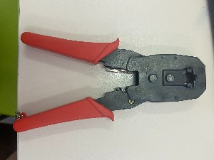
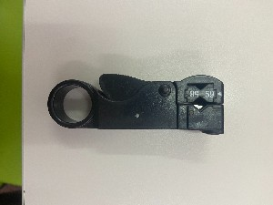
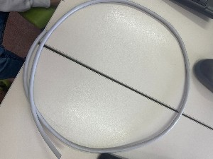
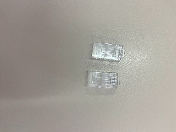
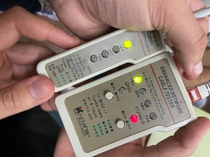

# CONSTRUCCIÓN DE CABLES UTP

**Samuel Álvarez Lorenzo y Bruno Amancio González Gorrín**
**1º Ciclo Superior de Administración de Sistemas Informáticos en Red.**

## ÍNDICE

+ [Instroducción](#id1)
+ [Objetivos](#id2)
+ [Material empleado](#id3)
+ [Desarrollo](#id4)
+ [Conclusiones](#id5)

### ***Introducción***. 

Los cables UTP son los encargados de ofrecer conexión entre dispositivos, ya sean PC, switches, Hubs, etc. Existen dos tipos de cable de par trenzado, el directo y el cruzado. El cable de par trenzado se divide a su vez en dos configuraciones, el T568-A y el T568-B. Además de estos, en esta práctica vamos a fabricar el cable de par trenzado hembra.

### ***Objetivos***. 

El objetivo que se nos presenta en esta práctica es la construcción de tres cables, un cable de par trenzado cruzado, un cable de par trenzado directo y un cable de par trenzado hembra, por nuestra cuenta haciendo uso de las herramientas a nuestra disposición. Además de esto, tenemos que hacer la debida comprobación de que dichos cables funcionen con corrección con la herramienta de testeo. Para esto disponemos de una serie de instrucciones que debemos seguir. El objetivo final es el de entregar los cables al profesor para que se compruebe si se han realizado con corrección.

### ***Material empleado***. 

Para esta práctica hemos hecho uso de un conjunto de herramientas:
1. Una crimpadora

 

2. Un pelacables

3. El cable

 

4. Conectores RJ45

5. Herramienta de testeo

En el vídeo que se adjuntan las fotos 

### ***Desarrollo*** 

*Cable cruzado y directo*
1. Pelamos el cable con el pelador
2. Quitamos su envoltorio
3. Ordenamos esos cables para su debido colocación en el rj45
4. Cortamos a la misma altura esos cables
5. Introducimos el cable en el rj45
6. Crimpamos el rj45
7. Comprobamos su funcionamiento con el tester y de PC a PC

*Cable rj45 hembra*
1. Hacemos una punta rj45 de cable directo macho
2. Desarmamos el conector hembra
3. Con los correspondientes cables de color vamos colocanbdolos donde nos indica su conector
4. Cortamos el cable sobrante
5. Cerramos el conector hembra
6. Comprobamos su funcionamiento con el tester

Los pasos que hemos seguido y el desarrollo de la práctica se explican de forma detallada, con imagenes y vídeos, en el siguiente vídeo: https://youtu.be/sAO7bnCPk6c.

Cabe destacar que la mayor dificultad que nos hemos encontrado ha sido la de poder introducir los cables de manera correcta en sus respectivos lugares, ya que se montaban unos sobre otros o directamente no entraban porque se doblaba su punta. Finalmente hemos podido solucionar este problema alineando mejor los cables antes de su introducción. Otro problema fue el uso del tester porque muchos tester que seleccionamos no funcionaban.

### ***Conclusiones***. 

Con el desarrollo de esta prática hemos podido aprender a construir los distintos tipos de cable que se han tratado en esta actividad, solucionando los distintos problemas que nos podamos llegar a encontrar. Además hemos aprendido ha realizar las debidas comprobaciones de los cables para ver si funcionan con normalidad y realizan su trabajo correctamente.