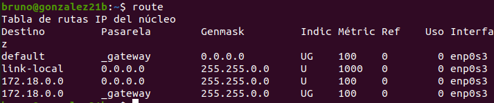

#**PRÁCTICA DE COMANDOS DE RED EN WINDOWS Y LINUX I**

**Objetivo**

La siguiente práctica está destinada a comprender algunos comandos importantes que son de gran utilidad en la administración de una red. 

**Material necesario**

Necesitaremos dos máquinas virtuales o reales. Una con un sistema operativo Windows y otra con Linux.

***1. Comando `ipconfig` (Windows)***

Este comando nos permite ver datos relacionados con la configuración de red de nuestro equipo. Algunas de sus principales opciones son:

***`ipconfig /all`***  -> Nos muestra información más detallada del adaptador de red.

***`ipconfig /release`*** -> Libera las configuración asignada por dhcp.

***`ipconfig /renew`*** -> Solicita al servidor DHCP la renovación de una configuración de red.

***`ipconfig /displaydns`*** -> Muestra el contenido de la caché DNS de nuestro equipo.

***`ipconfig /flushdns`*** -> Borra la caché DNS de nuestro equipo.

**Ejercicios**

+ Use el comando ***`ipconfig /all`*** para ver la dirección MAC de tu equipo.  Y la siguiente aplicación <http://coffer.com/mac_find/> para rellenar la siguiente tabla.

|Dirección IP v4||  172.18.99.103
| - | - | 
|Máscara||  255.255.0.0
|Gateway||  172.18.0.1
|MAC||  08-00-27-CD-8E-FC
|Fabricante||   cadmus computer systems
|Dirección IP v6||  fe80::8963:459e:8932:60c2%6
|Servidores DNS||   80.58.61.250
|Tiempo de concesión de la IP|| martes, 10 de enero de 2023 9:08:28 24 horas.
|Nombre del adaptador de red||  Intel(R) PRO/1000 MT Desktop Adapter

+ Liberar la configuración IP del adaptador con ***`ipconfig /release`*** y a continuación volver a usar el comando ***`ipconfig`*** . ¿Cuál es la ip ahora?

Dirección IPv4: 169.254.96.194

+ Ejecutar el comando ***`ipconfig /renew`*** solicitando una renovación de dirección IP. A continuación volver a ejecutar ***`ipconfig`*** . ¿Cuál es la nueva ip?

Dirección IPv4: 172.18.99.103

+ Ejecutar el comando ***`ipconfig /displaydns`*** y comprobar la información que contiene la caché DNS de tu equipo. Ejecuta ahora el comando ***`ipconfig /flushdns`** y después muestra otra vez el contenido de la caché DNS. ¿Qué información muestra ahora? ¿Qué ha ocurrido?*

No muestra información, porque se ha borrado la caché DNS del equipo.

+ Usar el navegador para ir a la web [https://www.w3schools.com]() y luego ejecutar el comando ***`ipconfig /displaydns`*** . Hacer una captura de pantalla donde se muestre que se ha cacheado la ip de ese nombre de dominio y pegarla aquí debajo.

+ Borra la caché DNS con el comando ***`ipconfig /flushdns`*** y muestra una captura de pantalla en que se vea que ya no hay registros DNS en caché.

***2. Comando `ifconfig` (Línux)***

Este comando nos permite mostrar la configuración IP de nuestra máquina y configurar algunos parámetros. Algunas opciones de interés son:

***`ifconfig  –a`*** -> Nos muestra la configuración de todas las tarjetas de red incluso las desactivadas.

***`ifconfig eth0 down`*** -> Desactiva una tarjeta de red llamada eth0. (También vale ***ifdown eth0***)

***`ifconfig eth0 up`*** -> Activa la tarjeta de red llamada eth1. (También vale ***ifup eth0***)

***`ifconfig eth0 192.168.1.1 netmask 255.255.255.192`*** -> Asigna una IP y una máscara a la tarjeta eth0.

**Ejercicios**

+ Ejecuta el comando ***`ifconfig`*** y rellena lo que puedas de la siguiente tabla.

|Dirección IP v4||  172.18.99.108
| - | - |
|Máscara||  255.255.0.0
|Gateway||  127.0.0.1
|MAC||  08:00:27:37:89:b7
|Fabricante||   cadmus computer systems
|Dirección IP v6||  fe80::9929:a11:c101:5c95
|Servidores DNS||   127.0.0.53
|Tiempo de concesión de la IP|| valid_lft 86132sec preferred_lft 86132sec
|Nombre del adaptador de red||  Intel Corporation 82801HM/HEM 

+ Desactiva tu tarjeta de red con el comando ***`ifconfig eth0 down`***. A continuación, comprueba con un ***`ifconfig`*** que la tarjeta ya no aparece, se ha desactivado. Haz una captura de pantalla donde se vea que ya no está activada.

+ Usa el comando ***`ifconfig –a`*** para ver que la tarjeta está desactivada (pega una captura de pantalla debajo).

+ Ahora activa la tarjeta con el comando ***`ifconfig eth0 up`*** y luego con el comando `ifconfig` comprueba que ya está habilitada (pega una captura de pantalla debajo).

+ Usa el comando ***`ifconfig eth0 192.168.99.99 netmask 255.255.255.0`*** y pega una captura de pantalla que muestre que el adaptador de red se ha configurado correctamente.

+ Usa el comando ***`ifconfig eth0 IP netmask Máscara`*** (con la configuración inicial de red) y pega una captura de pantalla que muestre que el adaptador de red se ha configurado correctamente.

***3. Comando ping (Windows y Línux)***

Se usa para saber si hay comunicación entre equipos. Podría “no funcionar” en caso de que el ordenador al que hacemos el ping tenga un firewall que ignore nuestros mensajes. 

Algunas opciones para Windows/Linux son

***-n*** -> Indica el número de paquetes que se enviarán. ( ***-c*** en linux)

***-l*** -> establece el tamaño del mensaje que se envía. ( ***-s*** en linux)

***-t*** -> envía paquetes de manera indefinida hasta que lo paramos con “***ctrl+c***”

***-i*** -> establecemos el TTL del ping, es decir, el número de saltos que debe dar antes de que lo destruyan. ( ***-t*** en linux)

**Ejercicios**

+ Desde una máquina con línux ejecuta el comando ***`ping –s 100 –c 2  ip\_puertadeenlace`*** para que se envíen dos ecos de 100 bytes. Muestra una captura de pantalla con el resultado.

+ Desde una máquina con windows usa el comando ***`ping –i 2 ip\_puertadeenlace`*** para hacer un ping a nuestra puerta de enlace con un TTL igual a 2. 

+ Luego haz un ping de las mismas características, pero a google ***`ping –i 2 www.google.es`*** Pega una captura de pantalla con el resultado y explica lo que ha pasado.

+ El comando ping nos da información sobre el tiempo de latencia de una red. Haz un ping a nuestra puerta de enlace y luego a otro a [www.google.es](http://www.google.es/). Busca información de lo que es el tiempo de latencia y compara los tiempos de latencia en ambos casos. 

El tiempo de latencia es el tiempo que tarda en transmitirse un paquete dentro de una red.

***4. Comando route (Línux)***

Nos permite ver y configurar la tabla de rutas de nuestro equipo. Algunas opciones de uso son: 

***`route`*** -> Nos muestra la tabla de enrutamiento del equipo.
***`route del default gw ip_gateway`*** -> Borra la ruta por defecto.
***`route add default gw ip_gateway`*** -> Añade la puerta de enlace indicada para nuestro host.

**Ejercicios**

+ Usa el comando `route` para ver la puerta de enlace de tu equipo. ¿Cuál es tu puerta de enlace?

0.0.0.0

+ Borra la puerta de enlace usando el comando `route del default gw ip_gateway`. A continuación, ejecuta el comando `route` para comprobar que ya no hay puerta de enlace. Intenta navegar por internet y verás que tampoco puedes. Haz una captura de pantalla con la salida del comando `route` y del resultado de `ping 8.8.8.8` ¿Cómo interpretas el mensaje que te devuelve el `ping`?

+ Vuelve a configurar la puerta de enlace usando el comando `route add default gw ip_gateway` y comprueba que ya ha vuelto la puerta de enlace con el comando `route`.

***5. Comando netstat (Línux y Windows)***

Nos muestra las conexiones que tiene nuestro host abiertas con la red. Algunas opciones para Linux son:

***-t*** → Muestra las conexiones tcp abiertas. (en windows -p tcp)
***-u*** → Muestra las conexiones udp abiertas. en windows -p udp)
***-a*** → Muestra los puertos que estén esperando conexiones (puertos en escucha). -n → Para que muestre solo información numérica.
***-s*** → Nos muestra estadísticas sobre nuestra conexión de red.
***-r*** → Nos muestra la tabla de enrutamiento de nuestro host.

**Ejercicios**

+ Abre una página web cualquiera y luego ejecuta el comando `netstat -t` para que nos muestre las conexiones que tenemos abiertas por tcp. Pon una captura de pantalla del resultado y explica lo que es cada una de las columnas que aparecen.

La primera columna es el protocolo de red, la segunda los paquetes recibidos, los paquetes enviados, la dirección local del equipo, la dirección remota del equipo, y el estado.

+ Ahora espera unos segundos y vuelve a ejecutar `netstat -tn`. Comprobarás que algunas de las conexiones se han cerrado o están esperando para cerrarse. Además con la opción **-n** verás los resultados en formato numérico. Pon una captura de pantalla y explica la diferencia entre ***Established***, ***Time_wait*** y ***Close_Wait***.

Se han cerrado todas las conexiones.

Time_wait-->El cliente se ha desconectado.
Established-->Conexión establecida.
Close_wait-->El punto final remoto ha finalizado la conexión.

+ Ejecuta ahora la orden `netstat -at` para que muestre las tanto las conexiones tcp abiertas como los puertos que están a la escucha. Copia una captura de pantalla donde se vean los puertos que tienes escuchando, explica qué significan los asteriscos en la columna ***“Foreign address”*** e investiga si tener esos puertos abiertos es normal o supone una amenaza.

Los asteriscos significan que la conexión puede originarse desde cualquier puerto de la máquina remota.

+ Ejecuta el comando `netstat -s` para ver las estadísticas de red y haz una captura en la que se vean cuantos paquetes tcp has recibido y cuantos de ellos han sido erroneos.

***6. Comando arp (Línux y Windows)***

Se usa para mostrar y administrar la caché `ARP` de nuestro equipo. Las opciones más habituales son:

***`arp -a`*** → Muestra la tabla arp del host (en línux no hace falta el -a)
***`arp -d dirección_ip`*** → borra de la tabla la entrada indicada
***`arp -d *`*** → borra toda la tabla arp (el equivalente en linux: `ip neigh flush all`) 
***`arp -s direccion_ip direccion_mac`*** → crea una entrada en la tabla ARP

**Ejercicios**

+ Borra toda la caché ARP con el comando `arp -d *`. A continuación haz un ping a la puerta de enlace. Pon una captura de la tabla ARP en que se vea que solo está la puerta de enlace y su mac.

+ Ahora borra manualmente la entrada arp de la puerta de enlace con la orden `arp -d ip_puertadeenlace`. Luego introduce manualmente una mac falsa para la puerta de enlace en la tabla arp con el comando `arp -s ip_puertadeenlace aa:bb:cc:dd:ee:ff` Haz una captura de pantalla en que se vea el resultado del comando arp -a y de hacer un ping a google. Explica por qué ahora no hay internet.

El segundo comando me da error, por lo tanto no adjunto captura.

+ Borra la entrada falsa de la tabla arp con el comando `arp -d ip_puertadeenlace`.

Al no poder hacer el anterior comando, este tampoco porque no funcionará igualmente.

***7. Comando nslookup (Línux y Windows)***

Este comando nos da información sobre la resolución de nombres dns. Nos dice a quién le hacemos la consulta y qué respuesta nos da. Opciones principales:

***`nslookup dominio`*** → Consulta a nuestro servidor dns por el dominio indicado.
***`nslookup dominio ip_servidordns`*** → consulta al servidor dns indicado por el dominio.

**Ejercicios**

Averigua el nombre del servidor DNS de 
https://www.puertodelacruz.es . A continuación, ejecutamos el comando nslookup nombreServidorDNS y luego el comando `nslookup nombreServidorDNS 8.8.8.8`. Explica las causas de las diferencias que hay entre los resultados de las dos consultas.

Al haber cambiado el servidor al que le hacemos la solicitud, cambia en el resultado, como se ven en las capturas.