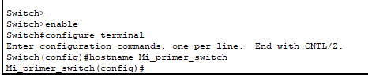
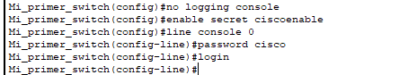
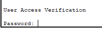
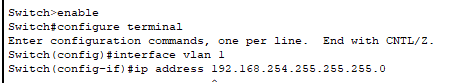
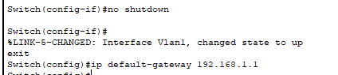
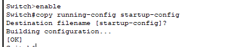
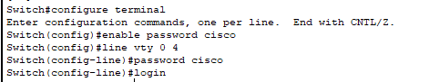

# Ejercicios Nivel de Enlace 
### **Ejer 1**
El ejercicio 1 ya se hizo en clase, por lo tanto no se explicará en el informe, sino que se adjuntarán los resultados directamente en el repositorio.

### **Ejer 2**
Para este ejercicio, sigo los pasos que se nos dan. Coloco un switch y un PC y los conecto por el puerto RS232.
Para asignar el nombre del switch escribo lo siguiente en la consola--> hostname Mi_primer_switch:

Continúo desactivando los mensajes de la consola y configuro una constraseña mediante los siguientes comandos:

Luego tendré que quitar el acceso con contraseña porque no consigo logear correctamente al detectarme como incorrecta la constraseña. Aquí se comprueba que se hizo correctamente:

Después de esto, coloco la IP y la máscara usando los comandos siguientes:

Grabo la configuración con lo siguiente:

Termino con este ejercicio activando el acceso mediante Telnet:

## **Ejer 3**

En este ejercicio pongo un switch 2950T y un PC con una tarjeta Gigabit y los conecto.

Por desgracia, el comando que se da en las instrucciones no funciona, por tanto no puedo realizar el ejercicio ya que no me da la información deseada.

Aún así, se adjunta el ejercicio en Packet Tracer para su corrección.