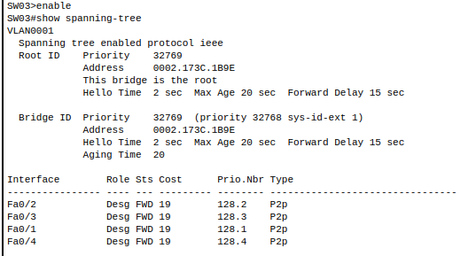
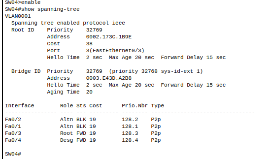
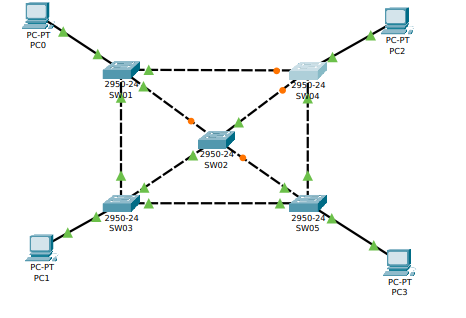
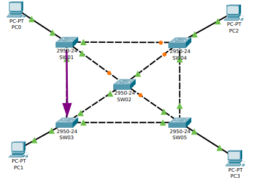
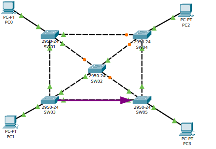
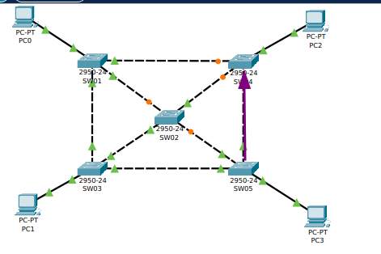
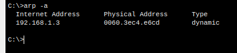
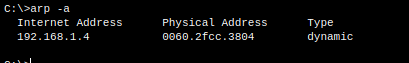
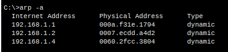
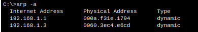

### *** Actividades STP Packet Tracer

## Identificar puente raíz.

El puente raíz es el SW03.

# Identificar los puertos no designados y en que switch se encuentran.

En el SW04.

# Comprobar que ya no existen bucles en nuestra red.

Como se ve en la imagen el protocolo STP, no hay bucles en la red.

# Comprobar que existe un camino único entre cada par de switches.

+ Entre el switch SW01 y el SW03

+ Entre el switch SW03 y el SW05

+ Entre el switch SW05 y el SW04

# Hacer pruebas de conectividad entre todos los equipos de la red.

+ PC0

+ PC1

+ PC2

+ PC3

