## EJERCICIO 1

1. Topología de red.

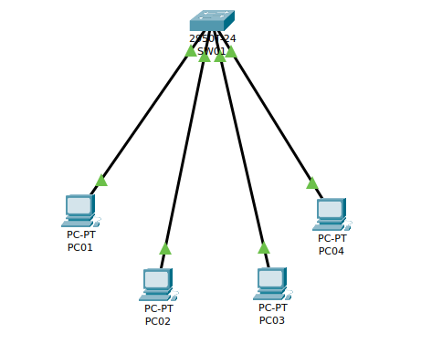

2. Insertar una nueva VLAN, que será la VLAN número 2, con el nombre PRUEBAV2.

Para mostrar las VLAN configuradas en el switch ejecutamos:

~~~
bruno_sw#show vlan brief

VLAN Name                             Status    Ports
---- -------------------------------- --------- -------------------------------
1    default                          active    Fa0/1, Fa0/2, Fa0/3, Fa0/4
                                                Fa0/5, Fa0/6, Fa0/7, Fa0/8
                                                Fa0/9, Fa0/10, Fa0/11, Fa0/12
                                                Fa0/13, Fa0/14, Fa0/15, Fa0/16
                                                Fa0/17, Fa0/18, Fa0/19, Fa0/20
                                                Fa0/21, Fa0/22, Fa0/23, Fa0/24
                                                Gig0/1, Gig0/2
1002 fddi-default                     active    
1003 token-ring-default               active    
1004 fddinet-default                  active    
1005 trnet-default                    active 
~~~

Para inseratar una nueva VLAN ejecutamos:
 ~~~
bruno_sw(config)#vlan 2 
bruno_sw(config-vlan)#name PRUEBAV2
 ~~~

Comprobamos que se ha creado correctamente la nueva VLAN:
~~~
bruno_sw#show vlan brief

VLAN Name                             Status    Ports
---- -------------------------------- --------- -------------------------------
1    default                          active    Fa0/1, Fa0/2, Fa0/3, Fa0/4
                                                Fa0/5, Fa0/6, Fa0/7, Fa0/8
                                                Fa0/9, Fa0/10, Fa0/11, Fa0/12
                                                Fa0/13, Fa0/14, Fa0/15, Fa0/16
                                                Fa0/17, Fa0/18, Fa0/19, Fa0/20
                                                Fa0/21, Fa0/22, Fa0/23, Fa0/24
                                                Gig0/1, Gig0/2
2    PRUEBAV2                         active    
1002 fddi-default                     active    
1003 token-ring-default               active    
1004 fddinet-default                  active    
1005 trnet-default                    active    
~~~

4. Realizar la configuración de las siguientes redes VLAN:

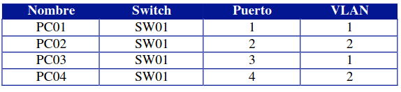

Para ello ejecutamos:

~~~
bruno_sw(config)#interface fastEthernet 0/2
bruno_sw(config-if)#switchport acces vlan 2
bruno_sw(config-if)#exit
bruno_sw(config)#interface fastEthernet 0/4
bruno_sw(config-if)#switchport access vlan 2
~~~

Vamos a comprobar que los puertos se han asignado correctamente a cada VLAN:

~~~
bruno_sw#show vlan brief

VLAN Name                             Status    Ports
---- -------------------------------- --------- -------------------------------
1    default                          active    Fa0/3, Fa0/5, Fa0/6, Fa0/7
                                                Fa0/8, Fa0/9, Fa0/10, Fa0/11
                                                Fa0/12, Fa0/13, Fa0/14, Fa0/15
                                                Fa0/16, Fa0/17, Fa0/18, Fa0/19
                                                Fa0/20, Fa0/21, Fa0/22, Fa0/23
                                                Fa0/24, Gig0/1, Gig0/2
2    PRUEBAV2                         active    Fa0/1, Fa0/2, Fa0/4
1002 fddi-default                     active    
1003 token-ring-default               active    
1004 fddinet-default                  active    
1005 trnet-default                    active    
~~~

5. Realizar ping entre los diferentes equipos para comprobar que la configuración
anterior funciona correctamente.

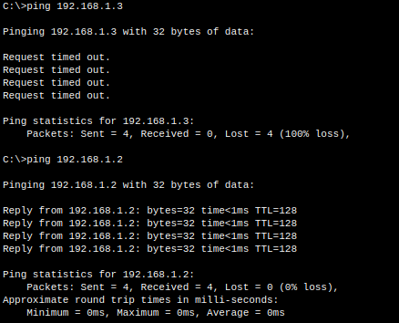

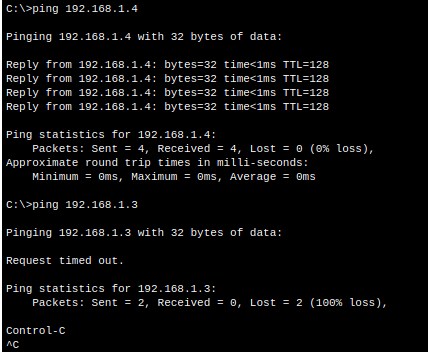


## EJERCICIO 2

1. Montamos la topología de red.

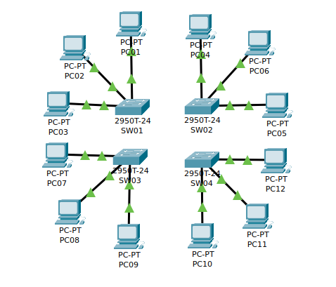

2. Insertar una nueva VLAN, que será la VLAN número 2, con el nombre PRUEBAV2; VLAN número 3, con el nombre PRUEBAV3.

Ejecutamos en cada switch los comandos:
~~~
bruno_sw01config)#vlan 2
bruno_sw01(config-vlan)#name PRUEBAV2 
bruno_sw01(config-vlan)#exit
bruno_sw01(config)#vlan 3
bruno_sw01(config-vlan)#name PRUEBAV3
~~~

Comprobamos que se han creado correctamente:
~~~
bruno_sw01#show vlan brief

VLAN Name                             Status    Ports
---- -------------------------------- --------- -------------------------------
1    default                          active    Fa0/1, Fa0/2, Fa0/3, Fa0/4
                                                Fa0/5, Fa0/6, Fa0/7, Fa0/8
                                                Fa0/9, Fa0/10, Fa0/11, Fa0/12
                                                Fa0/13, Fa0/14, Fa0/15, Fa0/16
                                                Fa0/17, Fa0/18, Fa0/19, Fa0/20
                                                Fa0/21, Fa0/22, Fa0/23, Fa0/24
                                                Gig0/1, Gig0/2
2    PRUEBAV2                         active    
3    PRUEBAV3                         active    
1002 fddi-default                     active    
1003 token-ring-default               active    
1004 fddinet-default                  active    
1005 trnet-default                    active    
~~~

4. Realizar la siguiente configuración de redes VLAN:

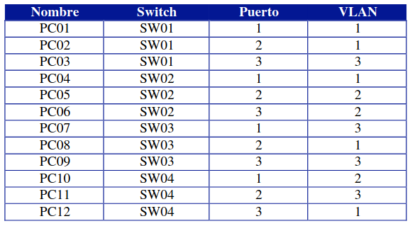
Ejecutamos el código siguiente sólo en aquellas máquinas que se conectan a las VLAN2 y VLAN3:
~~~
bruno_sw01(config)#interface fastEthernet 0/3
bruno_sw01(config-if)#switchport access vlan 3
~~~

AHora que hemos configurado las VLAN, vamos a guardar la configuración del switch, de manera que si la reiniciamos la cargue, para ello ejecutamos:
~~~
bruno_sw01#copy running-config startup-config
Destination filename [startup-config]? 
Building configuration...
[OK]
~~~

5.  Realizar ping entre los diferentes equipos para comprobar que la configuración de cada equipo funciona correctamente.

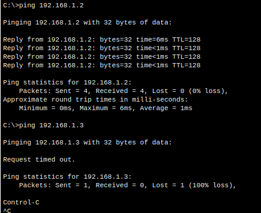

6. Unir los switchs de comunicaciones entre ellos siguiendo el siguiente esquema de conexiones:

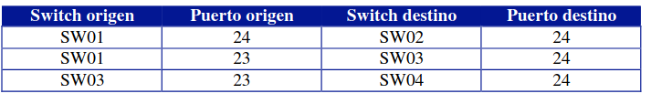

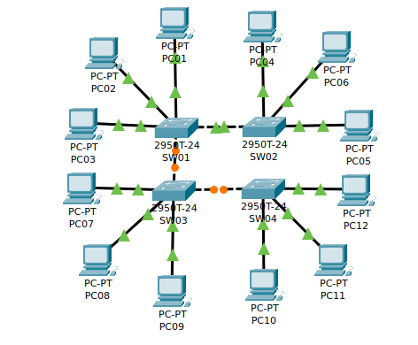

Para la VLAN 1 vemos que hay comunicación, esto se debe a que es la VLAN por defecto:

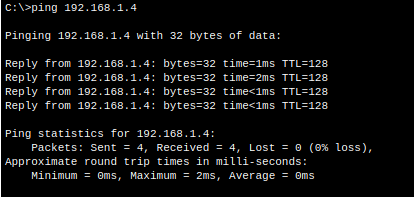

Comprobamos que para la VLAN2 no funciona porque no hay enlace TRUNK entre los switches:

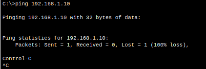

7. Colocar la siguiente configuración de puertos TRUNK de VLAN.

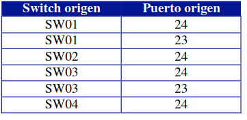

Comprobar que las comunicaciones entre los switchs funcionan correctamente. ¿Es esto cierto? ¿Para qué VLAN funciona correctamente?

La VLAN no funciona porque los switches no están trunkados.

Para configurar un puerto como trunk en un switch en Packet Tracer mediante la CLI, puedes usar los siguientes comandos:

+  Entra en modo de configuración global:

~~~
bruno_sw01>enable
bruno_sw01#conf
bruno_sw01#configure terminal 
Enter configuration commands, one per line.  End with CNTL/Z.
~~~
```
switch# configure terminal
```

+  Configura el modo de puerto para el puerto específico que deseas usar como trunk:

~~~
bruno_sw01(config)#interface fast
bruno_sw01(config)#interface fastEthernet 0/24
~~~

```
switch(config)# interface interface_number
```

+  Configura el modo de puerto para trunk:

~~~
bruno_sw01(config-if)#switchport mode trunk

bruno_sw01(config-if)#
%LINEPROTO-5-UPDOWN: Line protocol on Interface FastEthernet0/24, changed state to down

%LINEPROTO-5-UPDOWN: Line protocol on Interface FastEthernet0/24, changed state to up
~~~

```
switch(config-if)# switchport mode trunk
```

+  Configura los protocolos de VLAN permitidos en el trunk (opcional):

~~~
bruno_sw01(config-if)#switchport trunk allowed vlan 1,2,3
~~~

```
switch(config-if)# switchport trunk allowed vlan vlan_list
```

+  Verifica la configuración:

```
switch(config-if)# end
switch# show interfaces interface_number switchport
```

~~~
bruno_sw01#show interface fastEthernet 0/24 switchport
Name: Fa0/24
Switchport: Enabled
Administrative Mode: trunk
Operational Mode: trunk
Administrative Trunking Encapsulation: dot1q
Operational Trunking Encapsulation: dot1q
Negotiation of Trunking: On
Access Mode VLAN: 1 (default)
Trunking Native Mode VLAN: 1 (default)
Voice VLAN: none
Administrative private-vlan host-association: none
Administrative private-vlan mapping: none
Administrative private-vlan trunk native VLAN: none
Administrative private-vlan trunk encapsulation: dot1q
Administrative private-vlan trunk normal VLANs: none
Administrative private-vlan trunk private VLANs: none
Operational private-vlan: none
Trunking VLANs Enabled: 1-3
Pruning VLANs Enabled: 2-1001
Capture Mode Disabled
Capture VLANs Allowed: ALL
Protected: false
~~~

GUARDAR CON: copy running-config startup-config

Nota: Reemplaza "interface\_number" y "vlan\_list" con los valores apropiados para tu entorno.

2 / 2