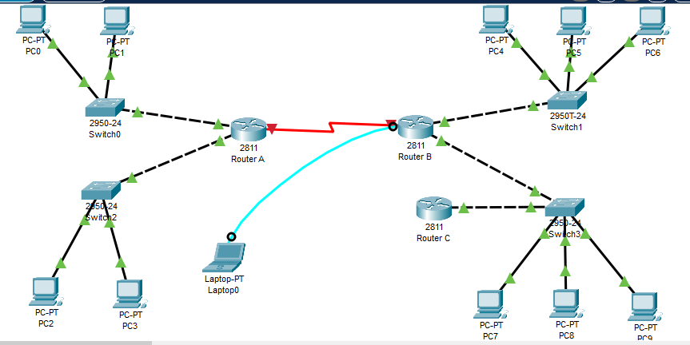

# EJERCICIO DE TABLAS DE ENCAMINAMIENTO

Dado el siguiente esquema:


1. Rellena las tablas de encaminamiento del `Router A`, `Router B` y `Router C` (usa las tablas que te suministra el profesor):

+ Router A
 
```
| DIRECCION DE RED | MASCARA       | ENCAMINADOR    | INTERFAZ | METRICA |
|------------------|---------------|----------------|----------|---------|
| 186.150.0.0      | 255.255.0.0   | 0.0.0.0        | L1       | 0       |
| 199.240.10.0     | 255.255.255.0 | 0.0.0.0        | L3       | 0       |
| 192.168.232.0    | 255.255.255.0 | 0.0.0.0        | L2       | 0       |
| 103.0.0.0        | 255.0.0.0     | 192.168.232.34 | L2       | 1       |
| 219.240.10.0     | 255.255.255.0 | 192.168.232.34 | L2       | 1       |
| 0.0.0.0          | 0.0.0.0       | 192.168.232.34 | L2       | 1       |
```


+ Router B

```
| DIRECCION DE RED | MASCARA       | ENCAMINADOR    | INTERFAZ | METRICA |
|------------------|---------------|----------------|----------|---------|
| 186.150.0.0      | 255.255.0.0   | 192.168.232.25 | L1       | 1       |
| 199.240.10.0     | 255.255.255.0 | 192.168.232.25 | L1       | 1       |
| 192.168.232.0    | 255.255.255.0 | 0.0.0.0        | L1       | 0       |
| 103.0.0.0        | 255.0.0.0     | 0.0.0.0        | L2       | 0       |
| 219.240.10.0     | 255.255.255.0 | 0.0.0.0        | L3       | 0       |
| 0.0.0.0          | 0.0.0.0       | 192.168.232.25 | L1       | 1       |
```

+ Router C

```
| DIRECCION DE RED | MASCARA       | ENCAMINADOR   | INTERFAZ | METRICA |
|------------------|---------------|---------------|----------|---------|
| 186.150.0.0      | 255.255.0.0   | 219.240.10.56 | L1       | 2       |
| 199.240.10.0     | 255.255.255.0 | 219.240.10.56 | L1       | 2       |
| 192.168.232.0    | 255.255.255.0 | 219.240.10.56 | L1       | 1       |
| 103.0.0.0        | 255.0.0.0     | 219.240.10.56 | L1       | 1       |
| 219.240.10.0     | 255.255.255.0 | 0.0.0.0       | L1       | 0       |
| 0.0.0.0          | 0.0.0.0       | 219.240.10.56 | L1       | 1       |
```

2. Realiza en Packet Tracer el diagrama de red tal y como el que se adjunta. Debes poner las direcciones ip que se indican así como los carteles. Configura en cada `PC` los parámetros de la red que le corresponden. Pon una imagen del resultado de tu montaje.




3. Establece el nombre de cada uno de los routers:

+ Router A

```
Router>enable
Router#configure terminal
Routera(config)#hostname RouterA
RouterA(config)#
```

+ Router B

```
Router>enable
Router#configure terminal 
Router(config)#hostname RouterB
RouterB(config)#
```

+ Router C

```
Router>enable
Router#configure terminal
Router(config)#hostname RouterC
RouterC(config)#
```

4. Configura el mensaje de bienvenida a cada uno de los routers `ROUTER A NOMBRE_ALUMNO`:

+ Router A

```
RouterA(config)#banner motd #ROUTER A BRUNO#
RouterA(config)#
```

+ Router B

```
RouterB(config)#banner motd #ROUTER B BRUNO#
RouterB(config)#
```

+ Router C

```
RouterC(config)#banner motd #ROUTER C BRUNO#
RouterC(config)#
```


5. Establece para cada router la contraseña `cisco2223` para el acceso a la configuración:

+ Router A

```
RouterA(config)#enable password cisco2223
RouterA(config)#
```

+ Router B

```
RouterB(config)#enable password cisco2223
RouterB(config)#
```

+ Router C

```
RouterC(config)#enable password cisco2223
RouterC(config)#
```

6. Configura las direcciones `IP` de cada una de las interfaces de los routers:

+ Router A

```
RouterA(config)#interface FastEthernet0/0
RouterA(config-if)#ip address 186.150.130.89 255.255.0.0

RouterA(config)#interface Serial0/2/0
RouterA(config-if)#ip address 192.168.232.25 255.255.255.0
```

+ Router B

```
RouterB(config)#interface Serial0/2/1
RouterB(config-if)#ip address 192.168.232.34 255.255.255.0


RouterB(config)#interface FastEthernet0/0
RouterB(config-if)#no shutdown
RouterB(config-if)#
%LINK-5-CHANGED: Interface FastEthernet0/0, changed state to up

%LINEPROTO-5-UPDOWN: Line protocol on Interface FastEthernet0/0, changed state to up
ip address 103.150.164.7 255.0.0.0
RouterB(config-if)#ip address 103.150.164.7 255.0.0.0
```

+ Router C

```
RouterC(config)#interface Serial0/2/0
RouterC(config-if)#ip address 219.240.10.25 255.255.255.0
```

7. Muestra un resumen de la configuración de las interfaces de cada router:

+ Router A

```
RouterA#show interfaces
FastEthernet0/0 is up, line protocol is up (connected)
  Hardware is Lance, address is 00d0.bcc1.d701 (bia 00d0.bcc1.d701)
  Internet address is 186.150.130.89/16
  MTU 1500 bytes, BW 100000 Kbit, DLY 100 usec,
     reliability 255/255, txload 1/255, rxload 1/255
  Encapsulation ARPA, loopback not set
  Full-duplex, 100Mb/s, media type is RJ45
  ARP type: ARPA, ARP Timeout 04:00:00, 
  Last input 00:00:08, output 00:00:05, output hang never
  Last clearing of "show interface" counters never
  Input queue: 0/75/0 (size/max/drops); Total output drops: 0
  Queueing strategy: fifo
  Output queue :0/40 (size/max)
  5 minute input rate 0 bits/sec, 0 packets/sec
  5 minute output rate 0 bits/sec, 0 packets/sec
     0 packets input, 0 bytes, 0 no buffer
     Received 0 broadcasts, 0 runts, 0 giants, 0 throttles
     0 input errors, 0 CRC, 0 frame, 0 overrun, 0 ignored, 0 abort
     0 input packets with dribble condition detected
     0 packets output, 0 bytes, 0 underruns
     0 output errors, 0 collisions, 1 interface resets
     0 babbles, 0 late collision, 0 deferred
 --More-- 
```

+ Router B

```
RouterB#show interfaces
FastEthernet0/0 is up, line protocol is up (connected)
  Hardware is Lance, address is 0003.e415.d901 (bia 0003.e415.d901)
  Internet address is 103.150.164.7/8
  MTU 1500 bytes, BW 100000 Kbit, DLY 100 usec,
     reliability 255/255, txload 1/255, rxload 1/255
  Encapsulation ARPA, loopback not set
  Full-duplex, 100Mb/s, media type is RJ45
  ARP type: ARPA, ARP Timeout 04:00:00, 
  Last input 00:00:08, output 00:00:05, output hang never
  Last clearing of "show interface" counters never
  Input queue: 0/75/0 (size/max/drops); Total output drops: 0
  Queueing strategy: fifo
  Output queue :0/40 (size/max)
  5 minute input rate 0 bits/sec, 0 packets/sec
  5 minute output rate 0 bits/sec, 0 packets/sec
     0 packets input, 0 bytes, 0 no buffer
     Received 0 broadcasts, 0 runts, 0 giants, 0 throttles
     0 input errors, 0 CRC, 0 frame, 0 overrun, 0 ignored, 0 abort
     0 input packets with dribble condition detected
     0 packets output, 0 bytes, 0 underruns
     0 output errors, 0 collisions, 1 interface resets
     0 babbles, 0 late collision, 0 deferred
 --More-- 
```

+ Router C

```
RouterC#show interfaces
FastEthernet0/0 is administratively down, line protocol is down (disabled)
  Hardware is Lance, address is 0001.96c8.7b01 (bia 0001.96c8.7b01)
  MTU 1500 bytes, BW 100000 Kbit, DLY 100 usec,
     reliability 255/255, txload 1/255, rxload 1/255
  Encapsulation ARPA, loopback not set
  Full-duplex, 100Mb/s, media type is RJ45
  ARP type: ARPA, ARP Timeout 04:00:00, 
  Last input 00:00:08, output 00:00:05, output hang never
  Last clearing of "show interface" counters never
  Input queue: 0/75/0 (size/max/drops); Total output drops: 0
  Queueing strategy: fifo
  Output queue :0/40 (size/max)
  5 minute input rate 0 bits/sec, 0 packets/sec
  5 minute output rate 0 bits/sec, 0 packets/sec
     0 packets input, 0 bytes, 0 no buffer
     Received 0 broadcasts, 0 runts, 0 giants, 0 throttles
     0 input errors, 0 CRC, 0 frame, 0 overrun, 0 ignored, 0 abort
     0 input packets with dribble condition detected
     0 packets output, 0 bytes, 0 underruns
     0 output errors, 0 collisions, 1 interface resets
     0 babbles, 0 late collision, 0 deferred
     0 lost carrier, 0 no carrier
 --More-- 
```


8. Configura en cada router las rutas estáticas en base las tablas que has rellenado en el apartado 1:

+ Router A

```
RouterA(config)#ip route 186.150.130.0 255.255.255.0 192.168.232.34
```

+ Router B

```
RouterB(config)#ip route 103.0.0.0 255.0.0.0 192.168.232.25
```

+ Router C

```
RouterC(config)#ip route 219.240.10.0 255.255.255.0 219.240.10.56
```

9. Muestra la tabla de enrutamiendo de cada router:

+ Router A

```
RouterA#show running-config 
Building configuration...

Current configuration : 954 bytes
!
version 15.1
no service timestamps log datetime msec
no service timestamps debug datetime msec
no service password-encryption
!
hostname RouterA
!
!
!
enable password cisco2223
!
!
!
!
!
!
no ip cef
no ipv6 cef
 --More-- 
```

+ Router B

```
RouterB#show running-config 
Building configuration...

Current configuration : 873 bytes
!
version 15.1
no service timestamps log datetime msec
no service timestamps debug datetime msec
no service password-encryption
!
hostname RouterB
!
!
!
enable password cisco2223
!
!
!
!
!
!
no ip cef
no ipv6 cef
 --More-- 
```

+ Router C

```
RouterC#show running-config 
Building configuration...

Current configuration : 788 bytes
!
version 15.1
no service timestamps log datetime msec
no service timestamps debug datetime msec
no service password-encryption
!
hostname RouterC
!
!
!
enable password cisco2223
!
!
!
!
!
!
no ip cef
no ipv6 cef
 --More-- 
```

10. Antes de hacer `ping` entre hosts muestra la tabla `arp` de los routers y de un `PC` de cada red:

+ Router A

```
RouterA#show arp 
Protocol  Address          Age (min)  Hardware Addr   Type   Interface
Internet  186.150.130.89          -   00D0.BCC1.D701  ARPA   FastEthernet0/0
Internet  199.240.10.43           -   00D0.BCC1.D702  ARPA   FastEthernet0/1
```

+ Router B

```
RouterB#show arp
Protocol  Address          Age (min)  Hardware Addr   Type   Interface
Internet  103.150.164.7           -   0003.E415.D901  ARPA   FastEthernet0/0
```

+ Router C

```
Aparece vacío
```

+ PC de la RED 1

```
C:\>arp -a
No ARP Entries Found
``` 

+ PC de la RED 2

```
C:\>arp -a
No ARP Entries Found
``` 

+ PC de la RED 3

```
C:\>arp -a
No ARP Entries Found
``` 


11. Realiza un un ping entre un PC de cada una de las redes con otro para comprobar la conectividad:

Por algún motivo, los equipos no tienen conexión entre ellos. He probado a arreglarlo pero no consigo encontrar el error.

+ RED 1 -> RED 2

```
C:\>ping 199.240.10.12

Pinging 199.240.10.12 with 32 bytes of data:

Request timed out.
Request timed out.

Ping statistics for 199.240.10.12:
    Packets: Sent = 3, Received = 0, Lost = 3 (100% loss),
``` 

+ RED 1 -> RED 3

```
C:\>ping 103.150.164.15

Pinging 103.150.164.15 with 32 bytes of data:


Ping statistics for 103.150.164.15:
    Packets: Sent = 1, Received = 0, Lost = 1 (100% loss),
``` 

+ RED 1 -> RED 4

```
C:\>ping 219.240.10.107

Pinging 219.240.10.107 with 32 bytes of data:


Ping statistics for 219.240.10.107:
    Packets: Sent = 1, Received = 0, Lost = 1 (100% loss),
``` 

+ RED 2 -> RED 1

```
C:\>ping 186.150.130.1

Pinging 186.150.130.1 with 32 bytes of data:


Ping statistics for 186.150.130.1:
    Packets: Sent = 1, Received = 0, Lost = 1 (100% loss),
``` 

+ RED 2 -> RED 3

```
C:\>ping 103.150.164.15

Pinging 103.150.164.15 with 32 bytes of data:

Reply from 199.240.10.43: Destination host unreachable.
Reply from 199.240.10.43: Destination host unreachable.
Reply from 199.240.10.43: Destination host unreachable.
Reply from 199.240.10.43: Destination host unreachable.

Ping statistics for 103.150.164.15:
    Packets: Sent = 4, Received = 0, Lost = 4 (100% loss),
``` 

+ RED 2 -> RED 4

```
C:\>ping 219.240.10.5

Pinging 219.240.10.5 with 32 bytes of data:

Reply from 199.240.10.43: Destination host unreachable.
Reply from 199.240.10.43: Destination host unreachable.
Reply from 199.240.10.43: Destination host unreachable.

Ping statistics for 219.240.10.5:
    Packets: Sent = 3, Received = 0, Lost = 3 (100% loss),
``` 

+ RED 3 -> RED 1

```
C:\>ping 186.150.130.1

Pinging 186.150.130.1 with 32 bytes of data:

Reply from 103.150.164.7: Destination host unreachable.
Reply from 103.150.164.7: Destination host unreachable.
Reply from 103.150.164.7: Destination host unreachable.

Ping statistics for 186.150.130.1:
    Packets: Sent = 3, Received = 0, Lost = 3 (100% loss),
``` 

+ RED 3 -> RED 2

```
C:\>ping 199.240.10.12

Pinging 199.240.10.12 with 32 bytes of data:

Reply from 103.150.164.7: Destination host unreachable.
Reply from 103.150.164.7: Destination host unreachable.

Ping statistics for 199.240.10.12:
    Packets: Sent = 2, Received = 0, Lost = 2 (100% loss),
``` 

+ RED 3 -> RED 4

```
C:\>ping 219.240.10.5

Pinging 219.240.10.5 with 32 bytes of data:

Reply from 103.150.164.7: Destination host unreachable.
Reply from 103.150.164.7: Destination host unreachable.

Ping statistics for 219.240.10.5:
    Packets: Sent = 2, Received = 0, Lost = 2 (100% loss),
``` 

+ RED 4 -> RED 1

```
C:\>ping 186.150.130.1

Pinging 186.150.130.1 with 32 bytes of data:


Ping statistics for 186.150.130.1:
    Packets: Sent = 1, Received = 0, Lost = 1 (100% loss),
``` 

+ RED 4 -> RED 2

```
C:\>ping 199.240.10.12

Pinging 199.240.10.12 with 32 bytes of data:


Ping statistics for 199.240.10.12:
    Packets: Sent = 1, Received = 0, Lost = 1 (100% loss),
``` 

+ RED 4 -> RED 3

```
C:\>ping 103.150.164.15

Pinging 103.150.164.15 with 32 bytes of data:


Ping statistics for 103.150.164.15:
    Packets: Sent = 1, Received = 0, Lost = 1 (100% loss),
``` 

12. Vuelve a  mostrar la tabla `arp` de los routers y de un `PC` de cada red:

+ Router A

```
RouterA#show arp
Protocol  Address          Age (min)  Hardware Addr   Type   Interface
Internet  186.150.130.1           7   00E0.F717.9106  ARPA   FastEthernet0/0
Internet  186.150.130.89          -   00D0.BCC1.D701  ARPA   FastEthernet0/0
Internet  199.240.10.12           7   00E0.8F6D.AB64  ARPA   FastEthernet0/1
Internet  199.240.10.43           -   00D0.BCC1.D702  ARPA   FastEthernet0/1
```

+ Router B

```
RouterB#show arp
Protocol  Address          Age (min)  Hardware Addr   Type   Interface
Internet  103.150.164.7           -   0003.E415.D901  ARPA   FastEthernet0/0
Internet  103.150.164.15          3   0060.5CDD.602E  ARPA   FastEthernet0/0
```

+ Router C

```
Vacío
```

+ PC de la RED 1

```
C:\>arp -a
No ARP Entries Found
``` 

+ PC de la RED 2

```
C:\>arp -a
No ARP Entries Found
``` 

+ PC de la RED 3

```
C:\>arp -a
No ARP Entries Found
``` 

13. Salva la configuración de cada uno de los routers:

+ Router A

```
RouterA#copy running-config startup-config 
Destination filename [startup-config]? 
Building configuration...
[OK]
```

+ Router B

```
RouterB#copy running-config startup-config 
Destination filename [startup-config]? 
Building configuration...
[OK]
```

+ Router C

```
RouterC#copy running-config startup-config 
Destination filename [startup-config]? 
Building configuration...
[OK]
```


RouterA(config)#interface FastEthernet0/1
RouterA(config-if)#no shutdown
RouterA(config-if)#
%LINK-5-CHANGED: Interface FastEthernet0/1, changed state to up


RouterB(config)#interface FastEthernet0/1
RouterB(config-if)#no shutdown
RouterB(config-if)#
%LINK-5-CHANGED: Interface FastEthernet0/1, changed state to up

RouterC(config)#interface FastEthernet0/0
RouterC(config-if)#no shutdown
RouterC(config-if)#
%LINK-5-CHANGED: Interface FastEthernet0/0, changed state to up