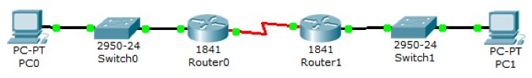
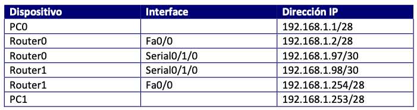

# ENRUTAMIENTO EIGRP 

Dado el esquema:

Vamos a implementar el protocolo de enrutamiento **EIGRP**. Partimos de la misma configuración de direcciones IP:

1. Construye la topología dada y asigna el direccionamiento en base a la tabla
2. Configura en ambos routers el protocolo de enrutamiento dinámico **EIGRP** :

+ Router0

~~~
R0(config)#router eigrp 101
R0(config-router)#network 192.168.1.0
~~~

+ Router1

~~~
R1(config)#router eigrp 101
R1(config-router)#network 192.168.1.0
%DUAL-5-NBRCHANGE: IP-EIGRP 101: Neighbor 192.168.1.97 (Serial0/0/1) is up: new adjacency
~~~

3. Muestra los protocolos de enrutamiento

+ Router0

~~~
R0#show ip protocols 

Routing Protocol is "eigrp  101 " 
  Outgoing update filter list for all interfaces is not set 
  Incoming update filter list for all interfaces is not set 
  Default networks flagged in outgoing updates  
  Default networks accepted from incoming updates 
  EIGRP metric weight K1=1, K2=0, K3=1, K4=0, K5=0
  EIGRP maximum hopcount 100
  EIGRP maximum metric variance 1
Redistributing: eigrp 101
  Automatic network summarization is in effect  
  Automatic address summarization: 
  Maximum path: 4
  Routing for Networks:  
     192.168.1.0
  Routing Information Sources:  
    Gateway         Distance      Last Update 
    192.168.1.98    90            931824     
  Distance: internal 90 external 170
~~~

+ Router1

~~~
R1#show ip protocols 

Routing Protocol is "eigrp  101 " 
  Outgoing update filter list for all interfaces is not set 
  Incoming update filter list for all interfaces is not set 
  Default networks flagged in outgoing updates  
  Default networks accepted from incoming updates 
  EIGRP metric weight K1=1, K2=0, K3=1, K4=0, K5=0
  EIGRP maximum hopcount 100
  EIGRP maximum metric variance 1
Redistributing: eigrp 101
  Automatic network summarization is in effect  
  Automatic address summarization: 
  Maximum path: 4
  Routing for Networks:  
     192.168.1.0
  Routing Information Sources:  
    Gateway         Distance      Last Update 
    192.168.1.97    90            922988     
  Distance: internal 90 external 170
~~~

4. Muestra las tablas de enrutamiento

+ Router0

~~~
R0#show ip route
Codes: C - connected, S - static, I - IGRP, R - RIP, M - mobile, B - BGP
       D - EIGRP, EX - EIGRP external, O - OSPF, IA - OSPF inter area
       N1 - OSPF NSSA external type 1, N2 - OSPF NSSA external type 2
       E1 - OSPF external type 1, E2 - OSPF external type 2, E - EGP
       i - IS-IS, L1 - IS-IS level-1, L2 - IS-IS level-2, ia - IS-IS inter area
       * - candidate default, U - per-user static route, o - ODR
       P - periodic downloaded static route

Gateway of last resort is not set

     192.168.1.0/24 is variably subnetted, 3 subnets, 2 masks
C       192.168.1.0/28 is directly connected, FastEthernet0/0
C       192.168.1.96/30 is directly connected, Serial0/0/1
D       192.168.1.240/28 [90/2172416] via 192.168.1.98, 00:01:55, Serial0/0/1
~~~

+ Router1

~~~
R1#show ip route
Codes: C - connected, S - static, I - IGRP, R - RIP, M - mobile, B - BGP
       D - EIGRP, EX - EIGRP external, O - OSPF, IA - OSPF inter area
       N1 - OSPF NSSA external type 1, N2 - OSPF NSSA external type 2
       E1 - OSPF external type 1, E2 - OSPF external type 2, E - EGP
       i - IS-IS, L1 - IS-IS level-1, L2 - IS-IS level-2, ia - IS-IS inter area
       * - candidate default, U - per-user static route, o - ODR
       P - periodic downloaded static route

Gateway of last resort is not set

     192.168.1.0/24 is variably subnetted, 3 subnets, 2 masks
D       192.168.1.0/28 [90/2172416] via 192.168.1.97, 00:02:10, Serial0/0/1
C       192.168.1.96/30 is directly connected, Serial0/0/1
C       192.168.1.240/28 is directly connected, FastEthernet0/0
~~~

5. Comprueba la conectividad entre los PC:

+ PC->PC1

~~~
C:\>ping 192.168.1.253

Pinging 192.168.1.253 with 32 bytes of data:

Reply from 192.168.1.253: bytes=32 time=1ms TTL=126
Reply from 192.168.1.253: bytes=32 time=1ms TTL=126
Reply from 192.168.1.253: bytes=32 time=1ms TTL=126
Reply from 192.168.1.253: bytes=32 time=1ms TTL=126

Ping statistics for 192.168.1.253:
    Packets: Sent = 4, Received = 4, Lost = 0 (0% loss),
Approximate round trip times in milli-seconds:
    Minimum = 1ms, Maximum = 1ms, Average = 1ms
~~~

+ PC1->PC0

~~~
C:\>ping 192.168.1.1

Pinging 192.168.1.1 with 32 bytes of data:

Reply from 192.168.1.1: bytes=32 time=1ms TTL=126
Reply from 192.168.1.1: bytes=32 time=1ms TTL=126
Reply from 192.168.1.1: bytes=32 time=1ms TTL=126
Reply from 192.168.1.1: bytes=32 time=1ms TTL=126

Ping statistics for 192.168.1.1:
    Packets: Sent = 4, Received = 4, Lost = 0 (0% loss),
Approximate round trip times in milli-seconds:
    Minimum = 1ms, Maximum = 1ms, Average = 1ms
~~~

6. Muestra la información de los nodos vecinos de EIGRP

+ Router0

~~~
R0#show ip eigrp neighbors 
IP-EIGRP neighbors for process 101
H   Address         Interface      Hold Uptime    SRTT   RTO   Q   Seq
                                   (sec)          (ms)        Cnt  Num
0   192.168.1.98    Se0/0/1        12   00:06:03  40     1000  0   3
~~~

+ Router1

~~~
R1#show ip eigrp neighbors 
IP-EIGRP neighbors for process 101
H   Address         Interface      Hold Uptime    SRTT   RTO   Q   Seq
                                   (sec)          (ms)        Cnt  Num
0   192.168.1.97    Se0/0/1        11   00:06:23  40     1000  0   3
~~~

7. Muestra toda la topología EIGRP:

+ Router0

~~~
R0#show ip eigrp topology 
IP-EIGRP Topology Table for AS 101/ID(192.168.1.97)

Codes: P - Passive, A - Active, U - Update, Q - Query, R - Reply,
       r - Reply status

P 192.168.1.0/28, 1 successors, FD is 28160
         via Connected, FastEthernet0/0
P 192.168.1.96/30, 1 successors, FD is 2169856
         via Connected, Serial0/0/1
P 192.168.1.240/28, 1 successors, FD is 2172416
         via 192.168.1.98 (2172416/28160), Serial0/0/1
~~~

+ Router1

~~~
R1#show ip eigrp topology 
IP-EIGRP Topology Table for AS 101/ID(192.168.1.254)

Codes: P - Passive, A - Active, U - Update, Q - Query, R - Reply,
       r - Reply status

P 192.168.1.0/28, 1 successors, FD is 2172416
         via 192.168.1.97 (2172416/28160), Serial0/0/1
P 192.168.1.96/30, 1 successors, FD is 2169856
         via Connected, Serial0/0/1
P 192.168.1.240/28, 1 successors, FD is 28160
         via Connected, FastEthernet0/0
~~~

