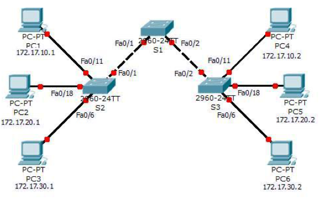

# RETO VTP

En esta práctica vamos a afrontar un reto `VTP`, debes seguir las instrucciones al pie de la letra. La topología de red para este reto es la siguiente:

La tabla de direccionamiento `IP` es la siguiente:

| DISPOSITIVO | INTERFAZ                 | DIRECCIÓN IP | MÁSCARA DE SUBRED |
| ----------- | ------------------------ | ------------ | ----------------- |
| S1          | VLAN99                   | 172.17.99.11 | 255.255.255.0     |
| S2          | VLAN99                   | 172.17.99.12 | 255.255.255.0     |
| S3          | VLAN99                   | 172.17.99.13 | 255.255.255.0     |
| PC1         | NIC                      | 172.17.10.1  | 255.255.255.0     |
| PC2         | NIV                      | 172.17.20.1  | 255.255.255.0     |
| PC3         | NIC                      | 172.17.30.1  | 255.255.255.0     |
| PC4         | NIC                      | 172.17.10.2  | 255.255.255.0     |
| PC5         | NIC                      | 172.17.20.2  | 255.255.255.0     |
| PC6         | NIC                      | 172.17.30.2  | 255.255.255.0     |

La tabla de asignaciones de puertos para los switches `S2` y `S3` es la siguiente:

| PUERTOS     | ASIGNACIONES             | RED            |
| ----------- | ------------------------ | -------------- |
| Fa0/1-0/5   | Enlaces troncales 802.1Q |                |
| Fa0/6-0/10  | VLAN 30 - Administración | 172.17.30.0/24 |
| Fa0/11-0/17 | VLAN 10 - Ingeniería     | 172.17.10.0/24 |
| Fa0/18-0/24 | VLAN 20 - Ventas         | 172.17.20.0/24 |
| Ninguno     | VLAN 99 - Mantenimiento  | 172.17.99.0/24 |

#### ***Configuraciones básicas de los switches.***

1. Configura el nombre de host de cada switch como se indica en la topología.

+ S1
~~~
Switch(config)#hostname S1
~~~

+ S2

~~~
Switch(config)#hostname S2
~~~

+ S3

~~~
Switch(config)#hostname S3
~~~

2. Deshabilita la búsqueda `DNS`.

 + S1
~~~
S1(config)#no ip domain-lookup 
~~~

+ S2

~~~
S2(config)#no ip domain-lookup
~~~

+ S3

~~~
S3(config)#no ip domain-lookup
~~~

3. Configura la  contraseña encriptada ***class***  del modo `EXEC` privilegiado.

 + S1
~~~
S1(config)#enable password class
~~~

+ S2

~~~
S2(config)#enable password class
~~~

+ S3

~~~
S3(config)#enable password class
~~~

4. Configura la contraseña ***cisco*** para las conexiones de la consola y VTY.

 + S1
~~~
S1(config)#enable secret cisco
~~~

+ S2

~~~
S2(config)#enable secret cisco
~~~

+ S3

~~~
S3(config)#enable secret cisco
~~~

#### ***Configuración de VTP en los switches.***

El `VTP` permite que el administrador de la red controle las instancias de las `VLAN` en la red mediante la creación de dominios de `VTP`. Dentro de cada dominio `VTP`, uno o más switches están configurados como ***servidores VTP***. Entonces, las `VLAN` se crean en el servidor VTP y se envían a los demás switches del dominio. Las tareas de configuración comunes del `VT`P son el modo operativo, el dominio y la contraseña. 

5. Configura el nombre de dominio del VTP como ***access*** y la contraseña del VTP como ***lab4*** en los tres switches.

 + S1
~~~
S1(config)#vtp domain access 
Changing VTP domain name from NULL to access
S1(config)#vtp password Lab4
Setting device VLAN database password to Lab4
~~~

+ S2

~~~
S2(config)#vtp domain access
Changing VTP domain name from NULL to access
S2(config)#vtp password Lab4
Setting device VLAN database password to Lab4
~~~

+ S3

~~~
S3(config)#vtp domain access
Changing VTP domain name from NULL to access
S3(config)#vtp password Lab4
Setting device VLAN database password to Lab4
~~~

6. Configura `S1` en modo servidor del VTP,  `S2` como cliente y `S3` en modo transparente.

>NOTA-1: Packet Tracer califica inicialmente el modo para `S3` como incorrecto. Esto se corrige más adelante en la actividad.

>NOTA-2: El nombre de dominio del `VTP` se puede adquirir por medio de un switch cliente desde un switch servidor, pero sólo si el dominio del switch cliente se encuentra en estado nulo. No adquiere un nombre nuevo si se ha establecido uno previamente. Por tal motivo, es mejor configurar de forma manual el nombre de dominio en todos los switches para asegurar que se configure correctamente. Los switches en los diferentes dominios `VTP` no intercambian información de `VLAN`.

+ S1
~~~
S1(config)#vtp mode server
Device mode already VTP SERVER.
~~~

+ S2

~~~
S2(config)#vtp mode client
Setting device to VTP CLIENT mode.
~~~

+ S3

~~~
S3(config)#vtp mode transparent 
Setting device to VTP TRANSPARENT mode.
~~~

7. Configura el enlace troncal y la ***VLAN nativa*** para las interfaces `FastEthernet 0/1-5` de los tres switches.

 + S1
~~~
S1(config)#interface fastEthernet 0/1
S1(config-if)#switchport mode access 
S1(config-if)#switchport access vlan 1
S1(config-if)#switchport mode trunk

S1(config-if)#
%LINEPROTO-5-UPDOWN: Line protocol on Interface FastEthernet0/1, changed state to down

%LINEPROTO-5-UPDOWN: Line protocol on Interface FastEthernet0/1, changed state to up

S1(config)#interface fastEthernet 0/2
S1(config-if)#switchport access vlan 1
S1(config-if)#switchport mode trunk

S1(config-if)#
%LINEPROTO-5-UPDOWN: Line protocol on Interface FastEthernet0/2, changed state to down

%LINEPROTO-5-UPDOWN: Line protocol on Interface FastEthernet0/2, changed state to up
~~~

+ S2

~~~
S2(config)#interface fastEthernet 0/1
S2(config-if)#sw
S2(config-if)#switchport mode acc
S2(config-if)#switchport mode access 
S2(config-if)#switchport access vlan 1
S2(config-if)#switchport mode trunk

S2(config-if)#
%LINEPROTO-5-UPDOWN: Line protocol on Interface FastEthernet0/1, changed state to down

%LINEPROTO-5-UPDOWN: Line protocol on Interface FastEthernet0/1, changed state to up
~~~

+ S3

~~~
S3(config)#interface fastEthernet 0/2
S3(config-if)#switchport mode access
S3(config-if)#switchport access vlan 1
S3(config-if)#switchport mode trunk

S3(config-if)#
%LINEPROTO-5-UPDOWN: Line protocol on Interface FastEthernet0/2, changed state to down

%LINEPROTO-5-UPDOWN: Line protocol on Interface FastEthernet0/2, changed state to up
~~~

8. Configura los puertos `Fa0/6`, `Fa0/11` y `Fa0/18` en `S2` y `S3` para permitir la conexión de un máximo de dos hosts a estos puertos y para que adquieran las direcciones `MAC` de los hosts de manera dinámica.

+ S2

~~~
S2(config)#interface fastEthernet 0/6
S2(config-if)#switchport port-security 
Command rejected: FastEthernet0/6 is a dynamic port.
S2(config-if)#switchport port-security maximum 2
S2(config-if)#switchport port-security mac-address sticky
S2(config-if)#exit
S2(config)#interface fastEthernet 0/18
S2(config-if)#switchport port-security 
Command rejected: FastEthernet0/18 is a dynamic port.
S2(config-if)#switchport port-security maximum 2
S2(config-if)#switchport port-security mac-address sticky 
S2(config-if)#exit
S2(config)#interface fastEthernet 0/11
S2(config-if)#switchport port-security 
Command rejected: FastEthernet0/11 is a dynamic port.
S2(config-if)#switchport port-security maximum 2
S2(config-if)#switchport port-security mac-address sticky 
~~~

+ S3

~~~
S3(config)#interface fastEthernet 0/6
S3(config-if)#switchport port-security 
Command rejected: FastEthernet0/6 is a dynamic port.
S3(config-if)#switchport port-security maximum 2
S3(config-if)#switchport port-security mac-address sticky 
S3(config-if)#exit
S3(config)#interface fastEthernet 0/11
S3(config-if)#switchport port-security 
Command rejected: FastEthernet0/11 is a dynamic port.
S3(config-if)#switchport port-security maximum 2
S3(config-if)#switchport port-security mac-address sticky 
S3(config-if)#exit
S3(config)#interface fastEthernet 0/18
S3(config-if)#switchport port-security 
Command rejected: FastEthernet0/18 is a dynamic port.
S3(config-if)#switchport port-security maximum 2
S3(config-if)#switchport port-security mac-address sticky 
~~~

9. Configura en el servidor VTP las `VLAN`:

+ `VLAN 99` mantenimiento
+ `VLAN 10` ingeniería
+ `VLAN 20` ventas
+ `VLAN 30` administración

 + S1
~~~
S1(config)#vlan 99
S1(config-vlan)#name mantenimiento
S1(config-vlan)#vlan 10
S1(config-vlan)#name ingenieria
S1(config-vlan)#vlan 20
S1(config-vlan)#name ventas
S1(config-vlan)#vlan 30
S1(config-vlan)#name administracion
~~~

10. Muestra un resumen de las `VLAN` en `S1`.

 + S1
~~~
S1#show vlan brief

VLAN Name                             Status    Ports
---- -------------------------------- --------- -------------------------------
1    default                          active    Fa0/3, Fa0/4, Fa0/5, Fa0/6
                                                Fa0/7, Fa0/8, Fa0/9, Fa0/10
                                                Fa0/11, Fa0/12, Fa0/13, Fa0/14
                                                Fa0/15, Fa0/16, Fa0/17, Fa0/18
                                                Fa0/19, Fa0/20, Fa0/21, Fa0/22
                                                Fa0/23, Fa0/24, Gig0/1, Gig0/2
10   ingenieria                       active    
20   ventas                           active    
30   administracion                   active    
99   mantenimiento                    active    
1002 fddi-default                     active    
1003 token-ring-default               active    
1004 fddinet-default                  active    
1005 trnet-default                    active   
~~~

11. Verifica si las `VLAN` que se crearon en S1 se propagaron a `S2` y  `S3`.

+ S2

~~~
S2#show vlan brief

VLAN Name                             Status    Ports
---- -------------------------------- --------- -------------------------------
1    default                          active    Fa0/2, Fa0/3, Fa0/4, Fa0/5
                                                Fa0/6, Fa0/7, Fa0/8, Fa0/9
                                                Fa0/10, Fa0/11, Fa0/12, Fa0/13
                                                Fa0/14, Fa0/15, Fa0/16, Fa0/17
                                                Fa0/18, Fa0/19, Fa0/20, Fa0/21
                                                Fa0/22, Fa0/23, Fa0/24, Gig0/1
                                                Gig0/2
10   ingenieria                       active    
20   ventas                           active    
30   administracion                   active    
99   mantenimiento                    active    
1002 fddi-default                     active    
1003 token-ring-default               active    
1004 fddinet-default                  active    
1005 trnet-default                    active   
~~~

+ S3

~~~
S3#show vlan brief

VLAN Name                             Status    Ports
---- -------------------------------- --------- -------------------------------
1    default                          active    Fa0/1, Fa0/3, Fa0/4, Fa0/5
                                                Fa0/6, Fa0/7, Fa0/8, Fa0/9
                                                Fa0/10, Fa0/11, Fa0/12, Fa0/13
                                                Fa0/14, Fa0/15, Fa0/16, Fa0/17
                                                Fa0/18, Fa0/19, Fa0/20, Fa0/21
                                                Fa0/22, Fa0/23, Fa0/24, Gig0/1
                                                Gig0/2
1002 fddi-default                     active    
1003 token-ring-default               active    
1004 fddinet-default                  active    
1005 trnet-default                    active    
~~~

+ ¿Están las mismas `VLAN` configuradas en todos los switches?

~~~
No, solo están estas vlan en el S2
~~~

+ ¿Por qué `S2` y `S3` tienen diferentes configuraciones de `VLAN` en este punto?

~~~
ESCRIBE TU RESPUESTA AQUÍ
~~~

+ ¿Cómo podemos solucionarlo ?

~~~
PEGA EL CÓDIGO AQUÍ
~~~

+ Muestra que las `VLAN` se han propagado correctamente después de haberlo solucionado.

+ S2

~~~
PEGA EL CÓDIGO AQUÍ
~~~

+ S3

~~~
PEGA EL CÓDIGO AQUÍ
~~~

12. Configura los tres switches con las direcciones `IP` identificadas en la tabla de direccionamiento al comienzo de la práctica . Asigna estas direcciones a la `VLAN` de administración de la red (VLAN 99).

 + S1
~~~
PEGA EL CÓDIGO AQUÍ
~~~

+ S2

~~~
PEGA EL CÓDIGO AQUÍ
~~~

+ S3

~~~
PEGA EL CÓDIGO AQUÍ
~~~

13. Verifiqua que los switches estén configurados correctamente haciendo ping entre ellos. Desde S1, haga ping a la interfaz administrativa en S2 y S3. Desde S2, haga ping en la interfaz de administración de S3.

+ S1->S2

~~~
PEGA EL RESULTADO DEL PING AQUÍ
~~~

+ S1->S3

~~~
PEGA EL RESULTADO DEL PING AQUÍ
~~~

+ S2->S3

~~~
PEGA EL RESULTADO DEL PING AQUÍ
~~~

14. Asigna los  puertos de los  switch a las `VLAN`.

 + S1
~~~
PEGA EL CÓDIGO AQUÍ
~~~

+ S2

~~~
PEGA EL CÓDIGO AQUÍ
~~~

+ S3

~~~
PEGA EL CÓDIGO AQUÍ
~~~

15. Verifiqua que los enlaces troncales funcionen correctamente, para ello, desde el  `PC1`, intente hacer `ping` a  `PC4`, `PC5` y `PC6`.

+ PC1->PC4

~~~
PEGA EL RESULTADO DEL PING AQUÍ
~~~

+ PC1->PC5

~~~
PEGA EL RESULTADO DEL PING AQUÍ
~~~

+ PC1->PC6

~~~
PEGA EL RESULTADO DEL PING AQUÍ
~~~

+ ¿Tuvo éxito alguno de los pings?  

~~~
ESCRIBE TU RESPUESTA AQUÍ
~~~

+ ¿Por qué falló algún ping? 

~~~
ESCRIBE TU RESPUESTA AQUÍ
~~~

+ ¿Qué hosts se alcanzaron desde PC3?

~~~
ESCRIBE TU RESPUESTA AQUÍ
~~~
