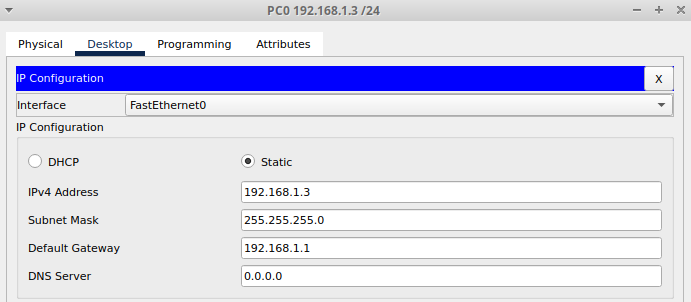
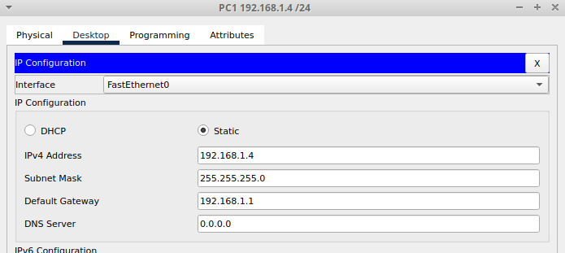

# CONFIGURACIÓN DE VLAN ESTÁTICAS

![[SCR-20230408-uxb.png]](img/SCR-20230408-uxb.png)

## Objetivo

-   Crear y verificar una configuración básica de switch.
-   Determinar la versión de firmware del switch.
-   Crear dos VLAN, otorgarles un nombre y asignarles puertos miembro.

## Información básica / Preparación

Al administrar un switch, el dominio de administración siempre es VLAN 1. La estación de trabajo del administrador de red debe tener acceso a un puerto en el dominio de administración VLAN 1. Todos los puertos son asignados a VLAN 1 por defecto. Esta práctica de laboratorio también ayudará a demostrar cómo las VLAN se pueden usar para separar el tráfico y reducir los dominios de broadcast.

Cree una red con un cableado similar al del diagrama. El resultado de la configuración que se utiliza en esta práctica de laboratorio se obtiene a partir de un switch serie 2950. El uso de cualquier otro switch puede producir unos resultados distintos. Ejecute los siguientes pasos en cada switch a menos que se le indique específicamente lo contrario. También se suministran instrucciones para los switch Serie 1900, que inicialmente muestra un Menú de interfaz de usuario. Seleccione la opción “Línea de comandos” del menú para ejecutar estos pasos para esta práctica de laboratorio.

Inicie una sesión de HyperTerminal.


## Paso 1 Configurar el switch

Configure el nombre de host, las contraseñas de acceso y modo de comando, así como también los parámetros de administración de la LAN. Estos valores se ilustran en la tabla. Si se producen problemas al ejecutar esta configuración, consulte la Práctica de Laboratorio Configuración básica del switch.

```
Switch(config)#hostname Switch_A

Switch_A(config)#enable secret class

Switch_A(config)#line vty 0 15
Switch_A(config-line)#password cisco

Switch_A(config)#interface vlan 1
Switch_A(config-if)#ip address 192.168.1.2 255.255.255.0
```

## Paso 2 Configurar los hosts conectados al switch

+Configure el host para que utilice la misma subred para la dirección, máscara y gateway por defecto que el switch.




## Paso 3 Verificar la conectividad

+ Para verificar que los hosts y los switches estén configurados correctamente, haga ping al switch desde el host.

```
C:\>ping 192.168.1.4

Pinging 192.168.1.4 with 32 bytes of data:

Reply from 192.168.1.4: bytes=32 time=3ms TTL=128
Reply from 192.168.1.4: bytes=32 time<1ms TTL=128
Reply from 192.168.1.4: bytes=32 time<1ms TTL=128
Reply from 192.168.1.4: bytes=32 time<1ms TTL=128

Ping statistics for 192.168.1.4:
    Packets: Sent = 4, Received = 4, Lost = 0 (0% loss),
Approximate round trip times in milli-seconds:
    Minimum = 0ms, Maximum = 3ms, Average = 0ms

C:\>
```
 
 + ¿El ping fue exitoso? 
 
```
El ping fue exitoso. 
C:\>ping 192.168.1.3

Pinging 192.168.1.3 with 32 bytes of data:

Reply from 192.168.1.3: bytes=32 time<1ms TTL=128
Reply from 192.168.1.3: bytes=32 time<1ms TTL=128
Reply from 192.168.1.3: bytes=32 time<1ms TTL=128
Reply from 192.168.1.3: bytes=32 time=13ms TTL=128

Ping statistics for 192.168.1.3:
    Packets: Sent = 4, Received = 4, Lost = 0 (0% loss),
Approximate round trip times in milli-seconds:
    Minimum = 0ms, Maximum = 13ms, Average = 3ms

C:\>
```

 + Si la respuesta es no, realice el diagnóstico de fallas en la configuración del host y del switch.


## Paso 4 Mostrar la versión de IOS

+ Es sumamente importante saber cuál es la versión del sistema operativo que se utiliza. Las diferencias entre las versiones pueden cambiar la forma en que se introducen los comandos. Escriba el comando `show version` en la petición de entrada del modo EXEC privilegiado:

```
Switch_A#show version 
Cisco Internetwork Operating System Software
IOS (tm) C2950 Software (C2950-I6Q4L2-M), Version 12.1(22)EA4, RELEASE SOFTWARE(fc1)
Copyright (c) 1986-2005 by cisco Systems, Inc.
Compiled Wed 18-May-05 22:31 by jharirba
Image text-base: 0x80010000, data-base: 0x80562000

ROM: Bootstrap program is is C2950 boot loader
Switch uptime is 23 minutes, 9 seconds
System returned to ROM by power-on

Cisco WS-C2950T-24 (RC32300) processor (revision C0) with 21039K bytes of memory.
Processor board ID FHK0610Z0WC
Last reset from system-reset
Running Standard Image
24 FastEthernet/IEEE 802.3 interface(s)
2 Gigabit Ethernet/IEEE 802.3 interface(s)

63488K bytes of flash-simulated non-volatile configuration memory.
Base ethernet MAC Address: 00D0.9732.0448
Motherboard assembly number: 73-5781-09 
Power supply part number: 34-0965-01
Motherboard serial number: FOC061004SZ
Power supply serial number: DAB0609127D
Model revision number: C0
Motherboard revision number: A0
 --More-- 
```

 
+ ¿Qué versión de IOS del switch aparece en pantalla?

```
IOS (tm) C2950 Software (C2950-I6Q4L2-M), Version 12.1(22)EA4, RELEASE SOFTWARE(fc1)
```

+ ¿Este switch tiene software de edición estándar o para empresas?

```
Running Standard Image
```

+ ¿Cuál es la versión de firmware o de IOS del switch?

```
Version 12.1(22)EA4
```

# Paso 5 Mostrar la información de la interfaz VLAN

+ En el Switch_A, escriba el comando show vlan en la petición de entrada del modo EXEC:

`Switch_A#show vlan 1900`

```
Switch_A#show vlan 1900--> No funciona

Switch_A#show vlan

VLAN Name                             Status    Ports
---- -------------------------------- --------- -------------------------------
1    default                          active    Fa0/1, Fa0/2, Fa0/3, Fa0/4
                                                Fa0/5, Fa0/6, Fa0/7, Fa0/8
                                                Fa0/9, Fa0/10, Fa0/11, Fa0/12
                                                Fa0/13, Fa0/14, Fa0/15, Fa0/16
                                                Fa0/17, Fa0/18, Fa0/19, Fa0/20
                                                Fa0/21, Fa0/22, Fa0/23, Fa0/24
                                                Gig0/1, Gig0/2
10   VLAN0010                         active    
1002 fddi-default                     active    
1003 token-ring-default               active    
1004 fddinet-default                  active    
1005 trnet-default                    active    

VLAN Type  SAID       MTU   Parent RingNo BridgeNo Stp  BrdgMode Trans1 Trans2
---- ----- ---------- ----- ------ ------ -------- ---- -------- ------ ------
1    enet  100001     1500  -      -      -        -    -        0      0
10   enet  100010     1500  -      -      -        -    -        0      0
1002 fddi  101002     1500  -      -      -        -    -        0      0   
1003 tr    101003     1500  -      -      -        -    -        0      0   
 --More-- 
```

`Switch_A#show vlan-membership`

```
No funciona

Switch_A#show vlan-membership
                  ^
% Invalid input detected at '^' marker.
```

+ ¿Cuáles son los puertos que pertenecen a la VLAN por defecto?

+ ¿Cuántas VLAN están configuradas por defecto en el switch?

```
1 VLAN. (VLAN 1)
```
¿Qué representa VLAN 1003? __________________________________________

```
1003 token-ring-default               active 
```
+ ¿Cuántos puertos hay en la VLAN 1003 ?

```
No tiene ningún puerto
```

## Paso 6 Crear y otorgar un nombre a dos VLAN

Introduzca los siguientes comandos para crear y otorgar un nombre a dos VLAN:
```
Switch_A#vlan database 
Switch_A(vlan)#vlan 2 name VLAN2 
Switch_A(vlan)#vlan 3 name VLAN3 
Switch_A(vlan)#exit
```

## Paso 7 Mostrar la información de la interfaz VLAN

+ En el Switch_A, escriba el comando `show vlan` en la petición de entrada del modo EXEC privilegiado como se indica a continuación:

```
Switch_A#show vlan

VLAN Name                             Status    Ports
---- -------------------------------- --------- -------------------------------
1    default                          active    Fa0/1, Fa0/2, Fa0/3, Fa0/4
                                                Fa0/5, Fa0/6, Fa0/7, Fa0/8
                                                Fa0/9, Fa0/10, Fa0/11, Fa0/12
                                                Fa0/13, Fa0/14, Fa0/15, Fa0/16
                                                Fa0/17, Fa0/18, Fa0/19, Fa0/20
                                                Fa0/21, Fa0/22, Fa0/23, Fa0/24
                                                Gig0/1, Gig0/2
2    VLAN2                            active    
3    VLAN3                            active    
10   VLAN0010                         active    
1002 fddi-default                     active    
1003 token-ring-default               active    
1004 fddinet-default                  active    
1005 trnet-default                    active    

VLAN Type  SAID       MTU   Parent RingNo BridgeNo Stp  BrdgMode Trans1 Trans2
---- ----- ---------- ----- ------ ------ -------- ---- -------- ------ ------
1    enet  100001     1500  -      -      -        -    -        0      0
2    enet  100002     1500  -      -      -        -    -        0      0
3    enet  100003     1500  -      -      -        -    -        0      0
10   enet  100010     1500  -      -      -        -    -        0      0
1002 fddi  101002     1500  -      -      -        -    -        0      0   
1003 tr    101003     1500  -      -      -        -    -        0      0   
1004 fdnet 101004     1500  -      -      -        ieee -        0      0   
1005 trnet 101005     1500  -      -      -        ibm  -        0      0   

VLAN Type  SAID       MTU   Parent RingNo BridgeNo Stp  BrdgMode Trans1 Trans2
---- ----- ---------- ----- ------ ------ -------- ---- -------- ------ ------

Remote SPAN VLANs
------------------------------------------------------------------------------

Primary Secondary Type              Ports
------- --------- ----------------- ------------------------------------------
```

+ ¿Se les ha asignado algún puerto?

```
No, no se les ha asignado ningún puerto
```

## Paso 8 Asignar puertos a VLAN 2

La asignación de puertos a las VLAN se debe realizar desde el modo de interfaz. Introduzca los siguientes comandos para agregar el puerto 2 a la VLAN 2:

```
PEGUE AQUÍ LOS COMANDOS UTILIZADOS
```

## Paso 9 Mostrar la información de la interfaz VLAN

+ En el Switch_A, escriba el comando `show vlan` en la petición de entrada del modo EXEC privilegiado como se indica a continuación:

```
PEGUE AQUÍ LOS COMANDOS UTILIZADOS
```

+ ¿El puerto 2 se ha asignado a la VLAN 2?

```
PEGUE AQUÍ LOS COMANDOS UTILIZADOS
```

+ ¿El puerto aún aparece en la lista de la VLAN por defecto?

```
PEGUE AQUÍ LOS COMANDOS UTILIZADOS
```

## Paso 10 Asignar puertos a VLAN 3

La asignación de puertos a las VLAN se debe realizar desde el modo de interfaz. Introduzca los siguientes comandos para agregar el puerto 3 a la VLAN 3:

```
PEGUE AQUÍ LOS COMANDOS UTILIZADOS
```

## Paso 11 Observar la información de la interfaz VLAN

+ En el Switch_A, escriba el comando show vlan en la petición de entrada del modo EXEC privilegiado como se indica a continuación:

```
PEGUE AQUÍ LOS COMANDOS UTILIZADOS
```

+ ¿El puerto 3 se ha asignado a la VLAN 3?

```
PEGUE AQUÍ LOS COMANDOS UTILIZADOS
```

+ ¿El puerto aún aparece en la lista de la VLAN por defecto?

```
PEGUE AQUÍ LOS COMANDOS UTILIZADOS
```

## Paso 12 Observar sólo la información de la VLAN2

+ En lugar de mostrar todas las VLAN, escriba el comando show vlan id 2 en la petición de entrada del modo EXEC privilegiado, como se indica a continuación :

```
PEGUE AQUÍ LOS COMANDOS UTILIZADOS
```

+ ¿Este comando suministra más información que el comando show VLAN?

```
PEGUE AQUÍ LOS COMANDOS UTILIZADOS
```

## Paso 13 Observar sólo la información de la VLAN2 con un comando distinto

+ En lugar de mostrar todas las VLAN, escriba el comando show vlan name VLAN2 en la petición de entrada del modo EXEC privilegiado.

```
PEGUE AQUÍ LOS COMANDOS UTILIZADOS
```

+ ¿Este comando suministra más información que el comando show VLAN?

```
PEGUE AQUÍ LOS COMANDOS UTILIZADOS
```

